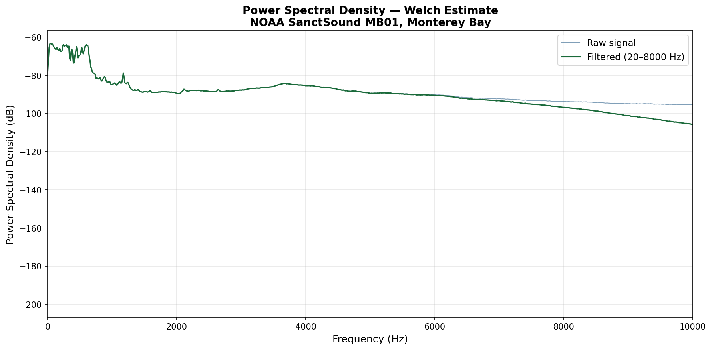

# NOAA Passive Acoustic Monitoring — Signal Processing Pipeline

Signal processing pipeline for underwater acoustic data from real NOAA hydrophone recordings. Implements standard passive acoustic monitoring (PAM) methods: bandpass filtering, power spectral density estimation, spectrogram generation, and energy-based acoustic event detection.

## Data Source

Real hydrophone recordings from the NOAA Passive Bioacoustic Dataset, SanctSound programme — Monterey Bay National Marine Sanctuary (MB01), SoundTrap recorder, April 2019.

Dataset: https://console.cloud.google.com/storage/browser/noaa-passive-bioacoustic

## Pipeline Steps

**1. Signal loading** — supports WAV and FLAC formats, reads configurable segment length

**2. Bandpass filtering** — Butterworth filter isolating biological activity band (20–8000 Hz), suppressing low-frequency shipping noise and high-frequency electronic noise

**3. Power Spectral Density** — Welch method PSD estimation, identifies dominant frequency components

**4. Spectrogram** — short-time Fourier transform, time-frequency representation of acoustic activity

**5. Event detection** — energy-based detector using sliding RMS window, threshold set at median + 6 dB

**6. SNR analysis** — signal-to-noise ratio across four standard PAM frequency bands (infrasound, low, mid, high)

## Results — Monterey Bay MB01, April 19 2019

- Sample rate: 48,000 Hz
- Duration analysed: 300 seconds (first 5 minutes)
- Acoustic events detected: 11
- Highest SNR band: Mid (200–2000 Hz) at 0.5 dB — biological activity range

## Output Plots

### Raw vs Filtered Signal


### Power Spectral Density


### Spectrogram with Event Detection and SNR


## Usage

```bash
pip install numpy scipy matplotlib soundfile
python acoustic_pipeline.py path/to/hydrophone.flac
```

Works with any WAV or FLAC hydrophone recording.

## Configuration

Edit the parameters at the top of `acoustic_pipeline.py`:

```python
SEGMENT_DURATION = 300   # seconds to analyse
BANDPASS_LOW     = 20    # Hz lower cutoff
BANDPASS_HIGH    = 8000  # Hz upper cutoff
DETECTION_THRESH = 6.0   # dB above median for event detection
```

## Author

Gamar Ismayilova — github.com/qama94
